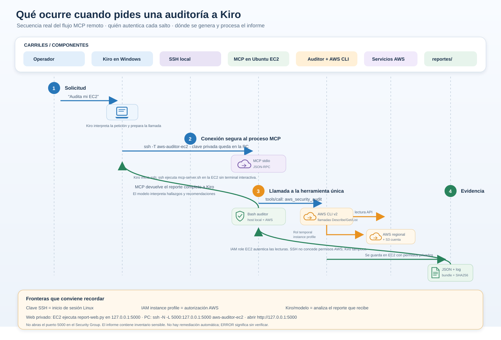

# Luishiño Pericena Choque

  

<strong>Creador de contenido tech · AWS Builder Center · Bolivia</strong>

  <a href="https://lpericena.blogspot.com/2026/">Blog</a> ·
  <a href="https://builder.aws.com/community/@luishino">AWS Builder Center</a> ·
  <a href="https://github.com/Pericena">GitHub</a> ·
  <a href="https://youtube.com/shorts/IGdl1ywo50U?feature=share">YouTube</a>

  <a href="https://builder.aws.com/connect/space/584c5ee2-dd3a-35ca-8f0a-bc09bf8dc8da/bootcamp-creadores-de-contenido-tech-latam-2026">Bootcamp Creadores de Contenido Tech LATAM 2026</a>

Comparto mi recorrido aprendiendo y creando con AWS: desde desplegar un e-commerce hasta construir un laboratorio de Cloud Security. Aquí encontrarás el video, los proyectos y las publicaciones del bootcamp.

## Video destacado

  

<a href="https://youtube.com/shorts/IGdl1ywo50U?feature=share"><strong>▶ Ver el video en YouTube Shorts</strong></a>

## Proyectos destacados

<table>
  <tr>
    <td width="50%" valign="top">
      <h3><a href="cloud_security_lab/">AWS Cloud Security Lab</a></h3>
      
Auditoría de solo lectura para revisar el hardening de Ubuntu/Debian y la configuración de seguridad de servicios AWS.

      
<a href="cloud_security_lab/readme.md">Explorar el proyecto</a> · <a href="cloud_security_lab/docs/kiro-aws-audit-flow.svg">Ver arquitectura</a>

    </td>
    <td width="50%" valign="top">
      <h3><a href="ecomerce/">E-commerce con Odoo</a></h3>
      
Proyecto práctico de e-commerce relacionado con AWS, Docker y Amazon EC2.

      
<a href="ecomerce/">Explorar el proyecto</a> · <a href="https://youtube.com/shorts/IGdl1ywo50U?feature=share">Ver demostración</a>

    </td>
  </tr>
</table>

## Diagramas del laboratorio

La arquitectura muestra cómo Kiro, SSH, MCP y el auditor de solo lectura se conectan con AWS, y cómo se genera la evidencia local.

  
Ver diagrama de secuencia de la auditoría

  
Flujo paso a paso de la solicitud, la autenticación y la generación del informe.

  

## Mi recorrido en el bootcamp

Este registro reúne las publicaciones y los proyectos del Bootcamp Creadores de Contenido Tech LATAM 2026.

**Participante:** Luishiño Pericena Choque · **Alias AWS Builder Center:** @luishino · **País:** Bolivia

## Publicaciones y proyectos

| Semana | Publicación | Tema y proyecto |
|---|---|---|
| 0 | [Mi punto de partida con AWS](https://builder.aws.com/post/3ImETfWqEnyRyGiApuBQXUWABrm_p/ejercicio-semana-0-mi-punto-de-partida-con-aws) | Inicio y exploración de AWS. |
| 1 | [Planificación: De mi celular a producción con AWS](https://builder.aws.com/post/3IrCTR1A7ImQ3x4rttxyoq1lRRi_p/ejercicio-semana-1-de-mi-celular-a-produccion-con-aws) | Propuesta previa a la entrega final. |
| 1 | [Entrega final: De mi celular a producción con AWS](https://builder.aws.com/post/3K5eRzsKaTmGqnrz9Z6ihMzSfvW_p/ejercicio-semana-1-de-mi-celular-a-produccion-con-aws) | E-commerce con Odoo, Docker y Amazon EC2 · [Repositorio](ecomerce/). |
| 2 | [Tarea 1: ¿Mi servidor está seguro?](https://builder.aws.com/post/3K5muxpjM2yvvjJ1ixQuW3A4K2V_p/ejercicio-semana-2-tarea-1-mi-servidor-esta-seguro-primeros-pasos-de-cloud-security-en-aws) | Primeros pasos de Cloud Security: EC2, Security Groups, IAM y MFA. |
| 2 | [Tarea 2: propuesta de charla](https://builder.aws.com/post/3K5oK0yAphELeFwX3udnB5xqUS9_p/ejercicio-semana-2-tarea-2-mi-servidor-esta-seguro-primeros-pasos-de-cloud-security-en-aws) | Charla práctica sobre seguridad de servidores AWS. |
| 3 | [Construyendo mi laboratorio de Cloud Security](https://builder.aws.com/post/3K5rnbhwmJEiqg0trPPNp3Q90cG_p/ejercicio-semana-3-construyendo-mi-laboratorio-de-cloud-security-en-aws) | AWS Cloud Security Lab · [Repositorio](cloud_security_lab/). |
| 4 | [De aprender a compartir: mi camino con AWS y Cloud Security](https://builder.aws.com/post/3K5wSJflp4Fa1TwIeIB8ln0Jd9G_p/semana-4-de-aprender-a-compartir-mi-camino-con-aws-y-cloud-security) | Reflexión y estrategia para seguir creando contenido. |
