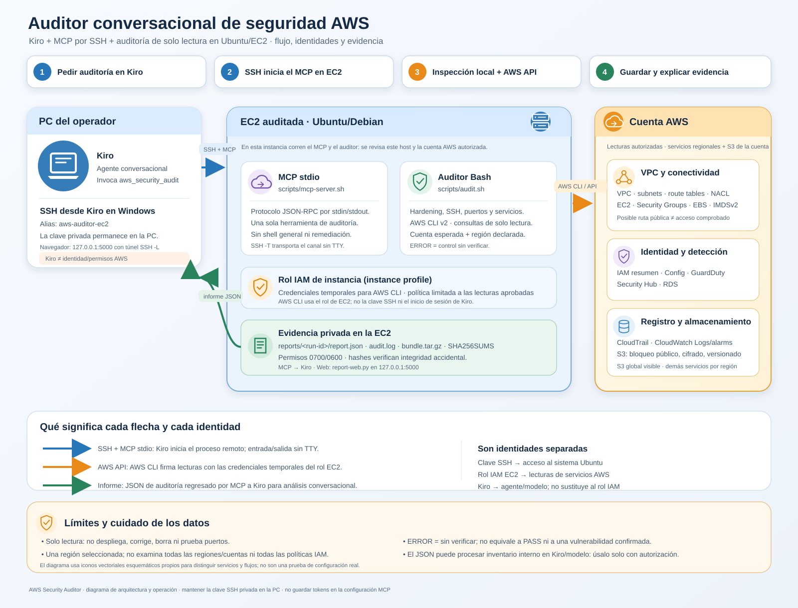

# Auditoría interna de hardening Linux y AWS

Este proyecto es un auditor de **solo lectura** para un servidor Ubuntu/Debian y su cuenta AWS. Recopila evidencia técnica de hardening, bitácoras y configuración de seguridad en el host local, revisa todos los buckets S3 visibles de la cuenta y examina servicios regionales únicamente en la región elegida. Cada ejecución crea un informe JSON y un respaldo verificable.

No es un escáner de vulnerabilidades CVE, no intenta explotar servicios, no instala software, no cambia configuración, no crea recursos AWS y no elimina servidores.



El primer diagrama explica la arquitectura, los iconos de servicios observados, el movimiento del informe y los límites. El [diagrama SVG de secuencia](docs/kiro-audit-sequence.svg) detalla paso a paso qué sucede al pedir una auditoría y qué identidad autentica cada conexión.

## Alcance y límites

```text
Administrador autorizado
        |
        +-- Bash: scripts/audit.sh (en Ubuntu/Debian)
        |     +-- Controles locales de hardening
        |     +-- Estado resumido de journald y metadatos de logs
        |     +-- Inventario de puertos en escucha y servicios relevantes
        |
        +-- AWS CLI v2 + identidad preconfigurada de solo lectura
              +-- S3: todos los buckets de la cuenta
              +-- Región AWS_REGION:
                    VPC/subnets/rutas/NACL, EC2/instance profile/IMDSv2/EBS/
                    Security Groups, IAM root summary,
                    CloudTrail, CloudWatch Logs/alarms, Config,
                    GuardDuty, Security Hub y RDS
        |
        +-- scripts/mcp-server.sh (opcional, MCP stdio)
              +-- expone solamente la herramienta aws_security_audit

Evidencia local: reports/<run-id>/{report.json,audit.log,bundle.tar.gz,SHA256SUMS}
```

La auditoría local inspecciona el **servidor en el que se ejecuta**. Las consultas AWS usan la identidad disponible a AWS CLI en ese mismo entorno. `AWS_REGION` controla la inspección de servicios regionales; el inventario S3 es global a la cuenta. No se recorren automáticamente todas las regiones.

Los controles AWS cubren identidad/cuenta, inventario de VPC, subredes, tablas de rutas y NACL; instancias EC2, asociación de IAM instance profile, IMDSv2, EBS cifrado y Security Groups con ingreso público; MFA y access keys de root (resumen), MFA de usuarios IAM con perfil de consola; accesibilidad/cifrado RDS; CloudTrail multi-región/integridad/logging; alarmas y retención de CloudWatch Logs; AWS Config, GuardDuty, Security Hub; y por cada bucket S3 ubicación, bloqueo público a nivel de cuenta/bucket, policy status, cifrado, versionado y access logging.

La CLI muestra el recorrido numerado por fases: host Ubuntu, identidad AWS, mapa de red/EC2/IAM/telemetría/S3 y generación de evidencia. Cada hallazgo imprime estado, severidad, control, evidencia y recomendación. El informe JSON conserva inventarios resumidos para correlacionar instancia, subnet, VPC, Security Groups, instance profile y rutas; también incluye reglas de entrada/salida SG, entradas NACL, alarmas CloudWatch y retención de grupos de logs.

La señal `EC2-NETWORK-PATH` correlaciona direcciones públicas IPv4/IPv6 con sus rutas por defecto correspondientes a un Internet Gateway, pero **no prueba conectividad externa**. El auditor no evalúa por completo NACL, firewall del host, binding del servicio, DNS ni cliente externo, y no ejecuta pruebas de puertos. Revisa esas capas manualmente y dentro de un alcance autorizado.

Los controles locales incluyen distribución/kernel, actualización simulada según caché APT, cuentas con shell interactivo y UID 0 duplicados, miembros directos del grupo `sudo`, firewall, sockets en escucha, configuración efectiva seleccionada de SSH, permisos de `/etc/shadow` y `authorized_keys`, estado de `auditd`/`fail2ban`/SSM Agent, sincronización horaria, estado resumido de journald y tipo del filesystem raíz. No se copian líneas de logs ni secretos.

El auditor no lee contraseñas, tokens, Access Keys, claves privadas ni el contenido de archivos de configuración sensibles. Recopila identificadores de recursos, nombres, IP privadas/públicas de EC2, CIDR y reglas de red, nombres de buckets/grupos de logs, puertos locales y metadatos de bitácoras. Esa información sigue siendo interna y debe protegerse; los artefactos se guardan localmente con permisos privados.

No revisa el contenido de objetos S3, ACL de cada objeto, todas las políticas IAM, todas las regiones, tráfico de red, procesos vulnerables, cada evento de CloudTrail ni todos los controles CIS. Un control `ERROR` significa **sin verificar**, no aprobado. Los resultados requieren interpretación y no son una certificación de seguridad.

### Qué cubre y qué no cubre

El recorrido cubre las comprobaciones enumeradas arriba para **el host local, S3 de la cuenta y los servicios compatibles en una sola región seleccionada**. No equivale a una auditoría exhaustiva de toda la organización AWS:

| Área | Qué observa este script | Qué queda fuera o requiere revisión humana |
| --- | --- | --- |
| EC2 y red | Inventario de VPC/subnet/rutas/NACL; EC2, EBS, profile, IMDSv2, reglas SG y rutas públicas potenciales IPv4/IPv6 | No evalúa reachability completa ni prueba puertos desde Internet |
| IAM | Resumen MFA/keys de root y MFA de usuarios con login de consola | No inspecciona políticas, permisos efectivos, access keys de usuarios o roles |
| CloudTrail y logs | Estado/configuración básica de trail y retención de grupos CloudWatch Logs | No lee eventos CloudTrail, contenido de logs, integridad criptográfica de cada archivo ni cobertura organizacional |
| CloudWatch | Inventaría alarmas y conserva estado/métrica/umbral resumidos | No certifica que cada instancia tenga las alarmas requeridas o que notifiquen al destinatario correcto |
| S3 | Configuración de bucket: región, bloqueo público, policy status, cifrado, versionado y access logging | No examina objetos, ACL por objeto, permisos de acceso efectivos ni toda combinación de políticas |
| Ubuntu/Debian | Controles locales enumerados y resumen de journald | No es un escáner CVE, no revisa procesos vulnerables y no exporta las líneas de logs |
| Cobertura regional | Servicios en una región AWS seleccionada; S3 se lista a nivel de cuenta | No recorre todas las regiones ni todas las cuentas de una organización |

La salida puede contener datos sensibles de inventario. Protege también los metadatos del informe y revisa/redacta la evidencia antes de compartirla.
Si una lectura de AWS falla o la identidad no tiene permiso, el control aparece como `ERROR` (sin verificar); por ejemplo, el campo de inventario de Block Public Access queda `null`, no `false`. No interpretes un dato desconocido como una configuración insegura o segura.

## Requisitos

- Ubuntu o Debian con Bash 4+, `jq` 1.6+, `tar`, `sha256sum`, `ss`/`iproute2` y `systemd` para cobertura local completa.
- Para AWS: AWS CLI **v2** y un rol/perfil autorizado de solo lectura.
- Para MCP stdio: los mismos requisitos que el auditor y un host MCP que pueda iniciar un proceso local `stdio`.
- Para el visor web: Python **3.10+**; usa solo módulos de la biblioteca estándar.

## Configuración rápida con `.env`

El auditor y el servidor MCP leen automáticamente `.env` desde la raíz del proyecto. Se ha creado un `.env` local con la región y el ID de cuenta que compartiste; confirma que sean todavía los correctos antes de usarlo. Si el archivo no está presente (por ejemplo, después de clonar desde Git), copia `.env.example` como `.env` y completa el ID de cuenta autorizado.

```bash
bash scripts/audit.sh
```

El archivo acepta únicamente `AWS_REGION`, `AWS_DEFAULT_REGION`, `AWS_EXPECTED_ACCOUNT_ID` y `AWS_PROFILE`, con formato simple `CLAVE=VALOR`. Las variables ya exportadas tienen prioridad; `--region REGION` prevalece durante esa ejecución. En EC2, deja `AWS_PROFILE` vacío para usar el IAM instance profile. En una máquina local, puedes indicar el nombre de un perfil AWS configurado de forma segura.

`.env` está excluido de Git y **no es un almacén de credenciales**: no agregues Access Keys, tokens, contraseñas, contenido/rutas de `.pem` ni secretos. La clave SSH se conserva en la PC y AWS se autentica mediante el rol EC2 o el perfil seguro ya configurado. Este archivo solo fija la región y protege contra ejecutar por accidente la auditoría en una cuenta distinta.

En Ubuntu/Debian:

```bash
sudo apt-get update
sudo apt-get install -y jq tar coreutils iproute2
```

Instala AWS CLI v2 desde el instalador oficial de AWS si no está disponible. Comprueba primero la arquitectura:

```bash
uname -m
aws --version
```

`aws-cli/2...` indica AWS CLI v2. Tanto el preflight como el auditor rechazan AWS CLI v1. Para `x86_64`, si hace falta instalarla:

```bash
sudo apt-get install -y curl unzip
curl -fL "https://awscli.amazonaws.com/awscli-exe-linux-x86_64.zip" -o /tmp/awscliv2.zip
unzip -q /tmp/awscliv2.zip -d /tmp
sudo /tmp/aws/install
aws --version
```

Usa el paquete `aarch64` solo si `uname -m` devuelve `aarch64` o `arm64`. No ejecutes un instalador de arquitectura distinta.

## Autenticación AWS

En una instancia EC2, prefiere un **IAM instance profile/rol** dedicado de solo lectura. No crees Access Keys y no uses la IP de la instancia como URL SSO. Si se usa IAM Identity Center, el inicio de sesión y perfil deben configurarse en el mismo entorno donde correrá el auditor; la URL SSO real la entrega IAM Identity Center o el administrador.

Para un rol de instancia, AWS CLI normalmente obtiene credenciales temporales automáticamente. Comprueba identidad y región antes de ejecutar:

```bash
unset AWS_PROFILE
export AWS_REGION=us-east-2
export AWS_EXPECTED_ACCOUNT_ID=ID_DE_CUENTA_DE_12_DIGITOS
aws sts get-caller-identity
```

Confirma que el campo `Account` sea la cuenta autorizada. En una máquina con perfil local:

```bash
export AWS_PROFILE=security-lab
export AWS_REGION=us-east-2
export AWS_EXPECTED_ACCOUNT_ID=ID_DE_CUENTA_DE_12_DIGITOS
aws sso login --profile "$AWS_PROFILE"   # solo si el perfil usa IAM Identity Center
aws sts get-caller-identity
```

El script no lee ni almacena credenciales. Si se define `AWS_EXPECTED_ACCOUNT_ID`, aborta las consultas de AWS cuando la cuenta no coincide.

## Permisos de solo lectura

La política de referencia está en [docs/iam-read-only-policy.json](docs/iam-read-only-policy.json). Solicita únicamente las acciones de lectura que utiliza el auditor, incluidas las consultas de VPC, subnets, route tables y NACL. El administrador debe revisarla y restringir el acceso al entorno y cuenta aprobados. Las acciones `Describe`/inventario pueden requerir `Resource: "*"`, mientras las lecturas de buckets se limitan a ARN de bucket.

Si una API no está permitida o el servicio no está habilitado, el informe lo registra como error/no verificado. No amplíes permisos automáticamente ni conviertas errores en `PASS`.

## Preparar y ejecutar

### Ejecutarlo sobre la instancia EC2 desde la terminal

El auditor local debe copiarse y ejecutarse **dentro de la Ubuntu que quieres
auditar**. La clave `.pem` solo se usa desde tu PC para SSH/SCP; no la copies a
la instancia ni la confundas con credenciales AWS.

Desde PowerShell en tu PC, situado en `C:\xampp\htdocs\SISTEMA\aws_builder`:

```powershell
$Key = "$HOME\.ssh\<ARCHIVO_PEM>"
$Target = "ubuntu@<IP_PUBLICA>"
scp -i $Key -r .\cloud_security_lab "${Target}:~/cloud_security_lab"
ssh -i $Key $Target
```

Ya dentro de Ubuntu, primero valida AWS CLI, cuenta y región. El rol IAM de EC2
es independiente de SSH; si la instancia no tiene un rol o no hay una sesión AWS
configurada en ese servidor, el chequeo de AWS no podrá autenticarse:

```bash
cd ~/cloud_security_lab
aws --version
aws sts get-caller-identity
```

Confirma que `Account` sea la cuenta autorizada y coincida con `AWS_EXPECTED_ACCOUNT_ID`
en `.env`. Luego ejecuta:

```bash
bash scripts/audit.sh
```

Así, la parte local examina la EC2 donde estás conectado; la parte AWS consulta
los recursos que permite tu identidad en la región indicada y los buckets S3
visibles de la cuenta. No realiza un test desde Internet y no modifica nada.

Para auditar solo Ubuntu, sin AWS:

```bash
bash scripts/audit.sh --local-only
```

No uses el modo local-only si esperas hallazgos de AWS: la salida lo indica y
marca explícitamente que IAM, EC2, red AWS, CloudTrail y S3 fueron omitidos.

El auditor crea `reports/` con permisos privados; no instala paquetes ni modifica AWS. En la salida, sigue las fases PASO 1 a PASO 4; los estados tienen color cuando la terminal lo admite. Al terminar se imprime un comando `jq` para leer hallazgos y otro para validar hashes.

La evidencia contiene inventario de seguridad y debe permanecer privada. En WSL, no ejecutes el proyecto desde `/mnt/c` si esa unidad no conserva permisos POSIX: usa una copia dentro del filesystem Linux (por ejemplo `~/cloud_security_lab`). El auditor detiene la ejecución si `chmod 700` no queda aplicado.

Se recomienda ejecutar con una identidad normal del servidor. Sin root algunas comprobaciones locales pueden quedar incompletas; el script **no ejecuta sudo**. Para profundizar privilegios, coordina la ejecución con la administración del host y la política de credenciales, especialmente si AWS usa SSO.

La configuración `.env` no crea ni obtiene credenciales. Si `aws sts get-caller-identity` falla o EC2 no tiene rol IAM, pide que le asocien un instance profile de solo lectura con las acciones de `docs/iam-read-only-policy.json`; usa SSO/perfil solo si está autorizado y configurado en ese servidor.

## Ver el reporte como una web privada

Después de ejecutar el auditor en la EC2, inicia el visor usando Python 3.10+ (solo biblioteca estándar, sin instalar Flask ni otros paquetes):

```bash
cd ~/cloud_security_lab
python3 scripts/report-web.py --host 127.0.0.1 --port 5000
```

El visor enlaza **solo `127.0.0.1` en la EC2**. Déjalo activo en esa terminal. Desde otra ventana de PowerShell en tu PC, abre el túnel SSH:

```powershell
ssh -N -L 5000:127.0.0.1:5000 aws-auditor-ec2
```

Mantén esa sesión abierta y navega en la PC a <http://127.0.0.1:5000>. Pulsa **Actualizar** para cargar el último informe. El visor presenta resumen de controles, filtros por estado/búsqueda, evidencia, recomendaciones e inventario. Detén el visor con `Ctrl+C` en la EC2 y el túnel con `Ctrl+C` en PowerShell.

No abras el puerto 5000 al público ni añadas una regla `0.0.0.0/0` al Security Group: el informe contiene datos internos y el visor no tiene login propio; el túnel SSH mantiene el acceso bajo la autenticación SSH existente. Si el puerto local 5000 ya está ocupado, cambia el lado local del túnel, por ejemplo `ssh -N -L 5001:127.0.0.1:5000 aws-auditor-ec2`, y abre <http://127.0.0.1:5001>.

### Prueba temporal de acceso desde Internet por el puerto 3000

Durante la prueba intenté abrir el visor desde el navegador del celular usando el
puerto TCP `3000`. Esto requiere dos cosas distintas: que el proceso escuche en
una interfaz alcanzable desde la red y que el Security Group permita el tráfico.
Abrir solo el puerto en AWS no cambia dónde escucha el proceso. El visor permite
elegir la interfaz (`--host`) y el puerto (`--port`); el puerto `5000` del
ejemplo privado anterior no necesita cambiarse.

1. Si expiró una sesión de AWS CLI, inicia sesión de nuevo desde la EC2 cuando
   ese método esté habilitado para tu instalación y perfil:

   ```bash
   aws login --remote
   aws sts get-caller-identity
   ```

   Confirma que la identidad y la cuenta sean las autorizadas. Si la instancia
   usa un IAM instance profile, prefiere ese rol y no reemplaces su
   configuración de credenciales sin autorización.

2. Consulta la IP pública y **todos** los Security Groups asociados a la
   instancia. Sustituye el ID por el de tu EC2; la región de este ejemplo es
   `us-east-2`:

   ```bash
   INSTANCE_ID="i-REEMPLAZA_CON_TU_ID"
   AWS_REGION="us-east-2"

   aws ec2 describe-instances \
     --instance-ids "$INSTANCE_ID" \
     --region "$AWS_REGION" \
     --query 'Reservations[0].Instances[0].{PublicIP:PublicIpAddress,SecurityGroups:SecurityGroups[*].{ID:GroupId,Name:GroupName}}' \
     --output json
   ```

   Elige el Security Group que realmente está asociado a la instancia y asigna
   su ID. No supongas que es el primer grupo de la lista:

   ```bash
   SG_ID="sg-REEMPLAZA_CON_EL_ID_CORRECTO"
   ```

3. Para una prueba directa, permite el puerto `3000` **solo desde tu IP pública
   de administración**, en formato CIDR `/32`:

   ```bash
   MY_IP_CIDR="TU_IP_PUBLICA/32"

   aws ec2 authorize-security-group-ingress \
     --group-id "$SG_ID" \
     --protocol tcp \
     --port 3000 \
     --cidr "$MY_IP_CIDR" \
     --region "$AWS_REGION"
   ```

   Si AWS devuelve `InvalidPermission.Duplicate`, no asumas que la regla
   existente es segura: comprueba el CIDR de la regla antes de continuar.

   ```bash
   aws ec2 describe-security-groups \
     --group-ids "$SG_ID" \
     --region "$AWS_REGION" \
     --query 'SecurityGroups[0].IpPermissions[?FromPort==`3000` && ToPort==`3000`]' \
     --output json
   ```

4. En la terminal de la EC2, inicia el visor escuchando en las interfaces de
   red y en el puerto de prueba:

   ```bash
   cd ~/cloud_security_lab
   python3 scripts/report-web.py --host 0.0.0.0 --port 3000
   ```

   Mantén esa terminal abierta mientras pruebas. Desde el navegador del celular,
   visita `http://IP_PUBLICA_DE_TU_EC2:3000`. Sustituye la dirección por la IP
   pública actual devuelta por EC2; `0.0.0.0` es una dirección de escucha del
   servidor, no la dirección que se escribe en el navegador.

5. Al terminar, detén el visor con `Ctrl+C` y elimina la regla temporal del
   Security Group. Usa el mismo CIDR que autorizaste:

   ```bash
   aws ec2 revoke-security-group-ingress \
     --group-id "$SG_ID" \
     --protocol tcp \
     --port 3000 \
     --cidr "$MY_IP_CIDR" \
     --region "$AWS_REGION"
   ```

**Seguridad:** los pasos del intento incluyeron autorizar TCP/`3000` desde
`0.0.0.0/0`. Eso permite conexiones desde cualquier IP de Internet; no dejes
esa regla activa ni la repitas para consultar informes. El visor no tiene
autenticación propia ni HTTPS y muestra inventario interno. Si se creó esa regla,
revócala indicando el mismo CIDR:

```bash
aws ec2 revoke-security-group-ingress \
  --group-id "$SG_ID" \
  --protocol tcp \
  --port 3000 \
  --cidr 0.0.0.0/0 \
  --region "$AWS_REGION"
```

Para una prueba pública posterior, limita la entrada a tu IP `/32`; para uso
normal, prefiere el túnel SSH privado de la sección anterior.

## Evidencia y respaldos

Cada ejecución crea un directorio único:

```text
reports/<run-id>/
├── report.json       # controles, hallazgos, inventario resumido y tiempos
├── audit.log         # bitácora de salida de la auditoría
├── bundle.tar.gz     # respaldo de report.json y audit.log
└── SHA256SUMS        # hashes para comprobar integridad del respaldo
```

El directorio, informe, log y bundle se crean con permisos locales restrictivos (`0700`/`0600`). Comprueba los hashes con:

```bash
cd reports/<run-id>
sha256sum -c SHA256SUMS
```

Los hashes detectan cambios accidentales, pero no sustituyen almacenamiento WORM, firma fuera del servidor, retención corporativa ni un repositorio de evidencia separado. El auditor no sube ni envía informes a AWS.

## Conectar Kiro a la EC2 por SSH

`scripts/mcp-server.sh` implementa un servidor MCP stdio en Bash y jq. Publica una herramienta fija, `aws_security_audit`, sin argumentos. Kiro puede actuar como el agente conversacional y llamar esta herramienta para ejecutar la auditoría y explicar su informe. El servidor no ofrece ejecución de shell ni remediación.

Este diseño hace que Kiro en Windows inicie `ssh` localmente y que el proceso MCP se ejecute dentro de Ubuntu en EC2. Así, el auditor examina ese host y AWS CLI usa el instance profile de la instancia; las credenciales de Kiro no se usan para AWS.

El servidor MCP devuelve el reporte JSON completo al cliente Kiro. Ese reporte puede incluir IP, IDs de recursos, CIDR y nombres internos; el agente o proveedor de modelo que uses podría procesar el contenido para responder. Verifica que su uso esté autorizado por tu organización y sus políticas de datos; si no, no conectes el informe a ese agente o redacta/limita la evidencia antes de compartirla.

1. Copia el proyecto y su archivo `.env` a `~/cloud_security_lab` en la EC2 e instala sus requisitos. Comprueba allí `aws --version`, `aws sts get-caller-identity` y que el rol de instancia tenga los permisos de lectura indicados en `docs/iam-read-only-policy.json`.
2. En Windows, agrega un alias SSH a `%USERPROFILE%\.ssh\config` y ajusta el host, usuario y ubicación de tu clave privada. No copies la clave al servidor ni al repositorio:

   ```sshconfig
   Host aws-auditor-ec2
       HostName <IP_O_DNS_DE_LA_EC2>
       User ubuntu
       IdentityFile ~/.ssh/srv01.pem
       IdentitiesOnly yes
   ```

3. Comprueba desde PowerShell que la conexión llega a la identidad AWS esperada:

   ```powershell
   ssh aws-auditor-ec2 "aws sts get-caller-identity"
   ```

4. Abre `.kiro/agents/aws-security-auditor.json` en tu copia local y ajusta el alias SSH y la ruta remota si difieren. La región y la cuenta esperada se leen del `.env` de la EC2. Este agente incluye solo los servidores MCP declarados en el archivo y limita sus herramientas a MCP; sus instrucciones prohíben cambios y remediaciones.
5. Abre el proyecto en Kiro, selecciona el agente de workspace `aws-security-auditor` y verifica en MCP Logs que el servidor aparezca conectado. Si Kiro no encuentra `ssh`, usa la ruta completa de `ssh.exe` en `command`.

El canal MCP utiliza `stdio` a través de SSH sin terminal interactiva (`-T`); no es un endpoint HTTP. El inicio de sesión de Kiro no concede permisos AWS, y el JSON no debe contener tokens de Kiro, Gemini, Access Keys ni claves privadas.

## Pruebas sin consultar AWS

Las pruebas usan un mock de AWS CLI para verificar que el auditor genera evidencia esperada y que no invoca operaciones mutables. La prueba adicional ejecuta el modo local-only en un directorio temporal privado de Linux y valida el informe y sus hashes:

```bash
bash tests/test-aws-readonly.sh
bash tests/test-mcp.sh
bash tests/test-local-only.sh
bash tests/test-env-config.sh
bash tests/test-terminal-colors.sh
python3 -m unittest discover -s tests -p 'test_report_web.py'
```

Las pruebas Bash requieren `jq`; la prueba de color también requiere `script` de util-linux; las pruebas web usan `unittest` de la biblioteca estándar. No requieren credenciales AWS ni acceso a una cuenta real. Las pruebas limpian únicamente sus propios directorios temporales.

## Estructura

```text
cloud_security_lab/
├── README.md
├── .env.example
├── .kiro/
│   └── agents/
│       └── aws-security-auditor.json
├── scripts/
│   ├── audit.sh
│   ├── load-env.sh
│   ├── mcp-server.sh
│   └── report-web.py
├── web/
│   └── index.html
├── docs/
│   ├── iam-read-only-policy.json
│   ├── kiro-aws-audit-flow.svg
│   └── kiro-audit-sequence.svg
├── tests/
│   ├── test-aws-readonly.sh
│   ├── test-mcp.sh
│   ├── test-local-only.sh
│   ├── test-env-config.sh
│   ├── test-terminal-colors.sh
│   └── test_report_web.py
└── reports/             # evidencia local; ignorada por Git
```
