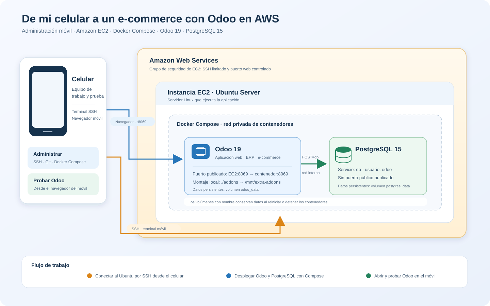

# E-commerce con Odoo en AWS

Una demostración práctica de despliegue de Odoo en una instancia Ubuntu de
Amazon EC2, usando Docker Compose para ejecutar Odoo y PostgreSQL. El proyecto
se preparó y administró desde un celular: desde la conexión al servidor y los
comandos de despliegue hasta la apertura de Odoo en el navegador móvil.

> **Alcance:** este repositorio contiene el despliegue base y el esqueleto de un
> módulo para Punto de Venta. No incluye un catálogo de productos, tema de tienda
> ni personalizaciones POS terminadas. Es una práctica educativa; antes de usarla
> públicamente o en producción, aplica las recomendaciones de seguridad de esta
> guía.

## Arquitectura



El celular puede usarse como terminal SSH para administrar el servidor y como
navegador para configurar y probar Odoo. Docker Compose conecta Odoo a PostgreSQL
por la red privada de los contenedores; el puerto de PostgreSQL no se publica en
Internet. Los volúmenes conservan la base de datos y los archivos de Odoo entre
reinicios.

## Componentes del proyecto

| Componente | Configuración actual | Función |
| --- | --- | --- |
| Amazon EC2 | Ubuntu Server | Servidor Linux donde se ejecuta el proyecto. |
| Docker Compose | Servicios `db` y `odoo` | Inicia y coordina los contenedores. |
| Odoo | Imagen `odoo:19` | Aplicación web y sistema ERP/e-commerce. |
| PostgreSQL | Imagen `postgres:15` | Base de datos de Odoo; accesible desde la red interna de Docker. |
| Volúmenes Docker | `postgres_data`, `odoo_data` | Conservan la base de datos y los datos de Odoo. |
| Addons | `./addons:/mnt/extra-addons` | Expone los módulos locales dentro del contenedor. |
| Módulo de ejemplo | `addons/mi_modulo` | Esqueleto instalable para Punto de Venta; aún no contiene lógica o vistas personalizadas. |

El servicio Odoo publica el puerto `8069` del servidor. Ajusta el grupo de
seguridad de EC2 para que solo las personas necesarias puedan acceder.

## Despliegue desde Ubuntu en EC2

### 1. Crear y proteger la instancia

1. Crea una instancia EC2 con Ubuntu Server y una clave SSH que puedas utilizar
   desde tu celular.
2. En el grupo de seguridad permite SSH (`22`) **solo desde tu IP de
   administración**. Para la prueba inicial de Odoo, permite TCP `8069` solo
   desde tu IP; no abras PostgreSQL (`5432`) al público.
3. Conéctate a la instancia y actualiza los paquetes:

   ```bash
   sudo apt update
   sudo apt upgrade -y
   ```

### 2. Instalar Docker y Docker Compose

En Ubuntu, instala Docker Engine y el plugin de Compose desde los paquetes de
Ubuntu:

```bash
sudo apt install -y docker.io docker-compose-v2
sudo systemctl enable --now docker
sudo docker --version
sudo docker compose version
```

Si `docker-compose-v2` no está disponible para tu versión de Ubuntu, sigue las
[instrucciones oficiales de instalación de Docker Engine](https://docs.docker.com/engine/install/ubuntu/)
y comprueba que `docker compose version` funcione antes de continuar.

### 3. Descargar el proyecto

```bash
sudo apt install -y git
git clone https://github.com/Pericena/aws_builder.git
cd aws_builder/ecomerce
```

### 4. Revisar las credenciales de la demostración

El archivo `docker-compose.yml` de este ejemplo usa `odoo` como contraseña de
PostgreSQL. Es un valor de demostración, **no una contraseña segura para una
instancia expuesta a Internet**. Antes del primer arranque, cambia
`POSTGRES_PASSWORD` y `PASSWORD` en `docker-compose.yml` por el mismo valor
fuerte, único y privado. No publiques credenciales en GitHub.

> Si PostgreSQL ya inicializó el volumen `postgres_data`, cambiar la variable
> `POSTGRES_PASSWORD` por sí sola no cambia la contraseña del usuario existente
> dentro de la base de datos. No elimines volúmenes para “reiniciar” una
> instalación con datos: contienen la información persistente.

### 5. Iniciar Odoo

Desde la carpeta `ecomerce`, inicia los servicios:

```bash
sudo docker compose up -d
sudo docker compose ps
sudo docker compose logs --tail=100 odoo
```

Espera a que Odoo complete el primer inicio. Después, desde el navegador del
celular o de la computadora, abre:

```text
http://IP_PUBLICA_DE_TU_EC2:8069
```

En la pantalla inicial crea la base de datos de Odoo y configura el correo y la
contraseña de administración. Guarda esas credenciales de forma privada. Luego
instala las aplicaciones que necesites desde Odoo; la disponibilidad de
**eCommerce** depende de los módulos instalados y de la configuración de la
instancia.

### 6. Comprobar y administrar los servicios

```bash
# Estado de los contenedores
sudo docker compose ps

# Seguir los registros de Odoo
sudo docker compose logs -f odoo

# Detener los servicios sin borrar los datos
sudo docker compose down

# Volver a iniciarlos
sudo docker compose up -d
```

`docker compose down` conserva los volúmenes nombrados. Evita
`docker compose down -v` salvo que quieras borrar permanentemente la base de
datos y los archivos guardados por Odoo.

## Cómo se trabajó desde el celular

El celular fue el equipo de trabajo para gestionar el despliegue y comprobar la
aplicación, no un servidor que ejecutara Odoo localmente:

1. Usar el navegador móvil para acceder a AWS y administrar la instancia EC2.
2. Conectar por SSH al Ubuntu desde una aplicación de terminal compatible con
   SSH; en Android se puede usar Termux con OpenSSH. Mantén la clave privada
   protegida y no la subas al repositorio.
3. Desde la sesión SSH, clonar el repositorio, instalar Docker y ejecutar
   Docker Compose en EC2.
4. Abrir la dirección de Odoo en el navegador del celular para crear la base de
   datos y verificar la interfaz.

Los nombres de aplicaciones móviles dependen del dispositivo. El requisito es
contar con un cliente SSH compatible, conservar la clave con permisos privados
y disponer de conexión a Internet.

## Módulo de Punto de Venta

El addon `addons/mi_modulo` declara una dependencia de `point_of_sale` y está
marcado como instalable. Es una plantilla inicial, no una personalización POS
lista para el negocio. Para que Odoo lo detecte:

1. Confirma que `./addons` está montado en `/mnt/extra-addons` (ya está declarado
   en `docker-compose.yml`).
2. En Odoo, activa el modo desarrollador.
3. Abre **Aplicaciones**, actualiza la lista de aplicaciones y busca
   **POS Custom**.
4. Instálalo después de instalar el módulo **Punto de venta**.

El addon actual no incluye modelos, pantallas, datos ni cambios funcionales.

## Seguridad antes de exponer el servicio

- Los valores incluidos en `docker-compose.yml` son únicamente para esta
  demostración. Cámbialos antes de desplegar una instancia accesible por otras
  personas y evita guardar secretos reales en el repositorio.
- Restringe SSH (`22`) a tu IP y limita temporalmente el acceso a Odoo (`8069`)
  a las direcciones que deban probarlo.
- No publiques el puerto de PostgreSQL (`5432`) ni agregues reglas para
  `0.0.0.0/0` para la base de datos.
- Para ofrecer el sitio públicamente, utiliza un dominio y HTTPS mediante un
  proxy inverso correctamente configurado. No expongas la instancia de prueba
  directamente como si fuera un servicio listo para producción.
- Usa respaldos de la base de datos y define un procedimiento de actualización
  antes de alojar datos reales.

## Estructura

```text
ecomerce/
├── Readme.md
├── docker-compose.yml
├── docs/
│   └── arquitectura-ecommerce-odoo.svg
└── addons/
    └── mi_modulo/
        ├── __init__.py
        ├── __manifest__.py
        └── models/
            └── __init__.py
```

## Video

[Ver “De mi celular a producción con AWS” en YouTube Shorts](https://youtube.com/shorts/IGdl1ywo50U?feature=share).

## Enlaces

- [Repositorio del proyecto](https://github.com/Pericena/aws_builder/tree/main/ecomerce)
- [AWS Cloud Security Lab](../cloud_security_lab/readme.md)
- [Blog de Luishiño Pericena](https://lpericena.blogspot.com/2026/)
